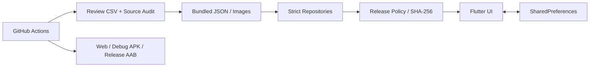

# 03_システム設計書

最終更新日: 2026年7月14日

## 1. 現行構成

現行MVPはバックエンドを持たないローカル完結型Flutterアプリである。

## 2. ランタイム層

- `lib/data/repositories`: 問題、カード、保存データを厳格に読み込む。
- `lib/domain/models`: 不変モデルとJSON変換を提供する。
- `lib/content_validation`: 構造検証、出典検証、内容ハッシュ、公開ポリシーを提供する。
- `lib/domain/services`: 日替わり選択、カード報酬、回答・閲覧統計を提供する。
- `lib/features`: オンボーディング、ホーム、問題、図鑑、設定、起動エラーを提供する。

## 3. データ

### questions.json

問題ID、カテゴリ、難易度、問題文、4選択肢、正答位置、解説、関連カードID、出典、検証状態を保持する。

### cards.json

カードID、タイトル、カテゴリ、短文、本文、画像パス、希少度、出典、画像レビューを保持する。

### content_manifest.json

問題数、カード数、公開可能問題数の期待値を保持し、空配列や意図しない削減を検出する。

### 保存データ

`SharedPreferences`へバージョン付きJSONとして保存する。日次完了は日付だけでなく問題IDとカードIDも保持し、所有カードIDは外部から変更できないリストとして公開する。

## 4. 公開判定

問題・カード組の正規化対象からSHA-256を計算する。対象には問題文、全選択肢、正答位置、解説、カードタイトル、短文、本文、画像パス、希少度を含む。実行時にも再計算し、承認時の`contentHash`と一致しない組は出題しない。

## 5. コンテンツ運用

1. JSONからレビューCSVをexportする。
2. 出典、本文、全選択肢、画像状態を人が確認する。
3. CSVをimportする際に不変列と内容ハッシュを照合する。
4. 承認情報、レビュー注記、画像レビューをJSONへ反映する。
5. CIで`--require-approved`監査とCSV往復を実行する。

## 6. 保存の並行制御

保存更新とリセットは同一FIFOキューへ投入する。先行処理の成功・失敗後に次処理を開始し、リセット直後に古い更新が保存を復活させる競合を防止する。

## 7. エラー処理

問題・カードJSON、保存JSONの読込失敗は空データへフォールバックしない。起動エラー画面へ遷移する。保存・リセット失敗は例外としてUIへ通知し、再試行できる状態を維持する。

## 8. CI

GitHub Actionsで以下を検証する。

- manifestを含むコンテンツ構造
- 全公開対象の出典、画像レビュー、内容ハッシュ
- レビューCSVのexport/import
- whitespace、Dart format、`flutter analyze`、`flutter test`
- Web、Android Debug APK、Android Release AAB

Release AABは短期CI鍵でコンパイル可否を確認する。ストア配布用署名とは分離する。

## 9. 将来拡張

クラウド同期、管理画面、課金、通知、分析基盤は将来候補であり、現行実装の前提ではない。導入する場合はプライバシーポリシー、ストア申告、認証・認可、データ移行を別設計する。
