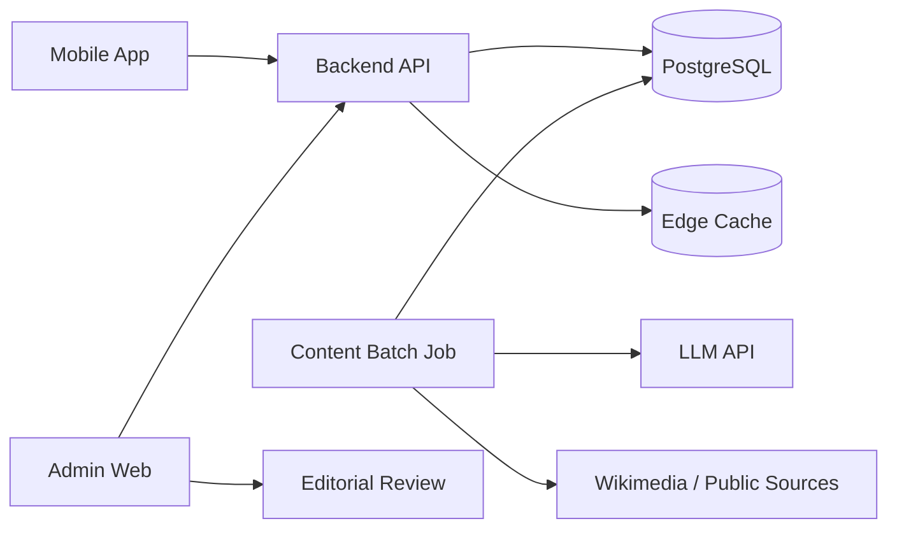
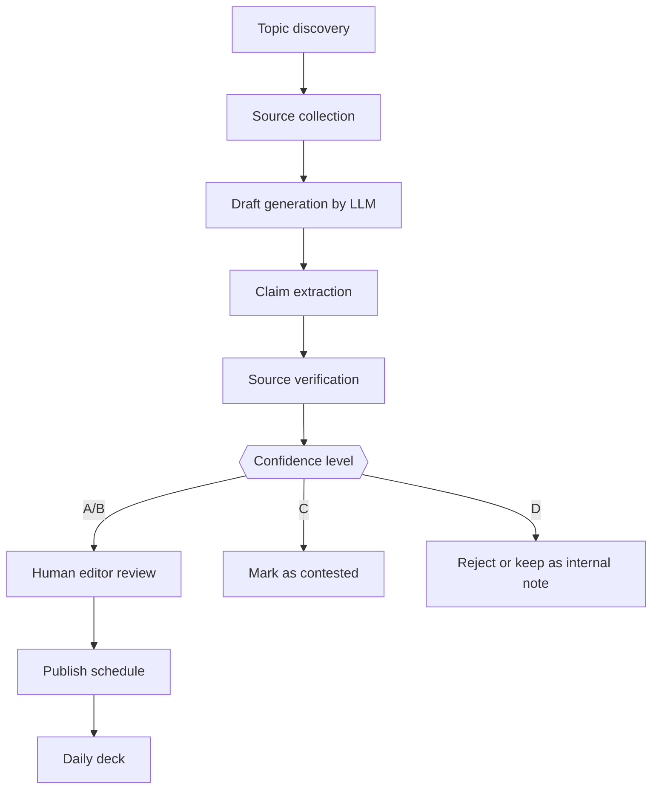

# 03_システム設計書

作成日: 2026-07-07

## 1. 推奨アーキテクチャ

MVPでは、実装速度と運用コストを優先し、以下の構成を推奨します。

```text
Mobile App: Flutter or React Native
Backend: Supabase / Firebase / Cloudflare Workers + PostgreSQL
Admin: Web 管理画面
AI Batch: Python job or Edge Function
Content Source: Wikimedia API, 公的機関, 企業公式, 書籍メモ等
Analytics: PostHog / Firebase Analytics / Supabase events
Payment: App Store / Google Play In-App Purchase
```

特に Flutter + Supabase は、個人開発でも一通り実装しやすい構成です。ただし、最初からリアルタイム性は不要なので、Firebase でも問題ありません。

## 2. 全体構成



## 3. コンテンツ生成パイプライン



## 4. データモデル概要

### categories

| カラム | 型 | 説明 |
|---|---|---|
| id | uuid | 主キー |
| slug | text | `daily_why` 等 |
| name | text | 表示名 |
| sort_order | int | 並び順 |

### cards

| カラム | 型 | 説明 |
|---|---|---|
| id | uuid | 主キー |
| title | text | カードタイトル |
| hook | text | 一覧用の短い一文 |
| short_body | text | 30秒説明 |
| long_body | text | 3分深掘り |
| category_id | uuid | カテゴリ |
| confidence_level | text | A/B/C/D |
| status | text | draft/review/approved/published/archived |
| publish_date | date | 公開日 |
| created_at | timestamptz | 作成日時 |
| updated_at | timestamptz | 更新日時 |

### card_sources

| カラム | 型 | 説明 |
|---|---|---|
| id | uuid | 主キー |
| card_id | uuid | 対象カード |
| title | text | 出典名 |
| url | text | URL |
| source_type | text | official/academic/wiki/media/book/other |
| retrieved_at | date | 取得日 |
| license_note | text | ライセンスメモ |
| quote_used | boolean | 引用を使ったか |

### card_relations

| カラム | 型 | 説明 |
|---|---|---|
| from_card_id | uuid | 元カード |
| to_card_id | uuid | 関連カード |
| relation_type | text | cause/history/material/word/etc |
| reason | text | 関連理由 |

### user_events

| カラム | 型 | 説明 |
|---|---|---|
| id | uuid | 主キー |
| user_id | uuid | ユーザー |
| event_type | text | card_view/save/quiz/share/source_click |
| card_id | uuid | 対象カード |
| metadata | jsonb | 詳細 |
| occurred_at | timestamptz | 発生日時 |

## 5. API設計概要

| Method | Path | 説明 |
|---|---|---|
| GET | /v1/daily-deck | 今日の3枚を取得 |
| GET | /v1/cards/{{cardId}} | カード詳細を取得 |
| GET | /v1/cards/{{cardId}}/related | 関連カード取得 |
| POST | /v1/cards/{{cardId}}/save | 保存 |
| DELETE | /v1/cards/{{cardId}}/save | 保存解除 |
| POST | /v1/events | 閲覧・保存等のイベント送信 |
| GET | /v1/me/stats | 読了数・ストリーク取得 |
| GET | /v1/categories | カテゴリ一覧 |

管理者向け API は `/admin/v1` として分離する。

## 6. キャッシュ方針

| 対象 | キャッシュ |
|---|---|
| 今日の共通デッキ | 24時間 |
| カード詳細 | 更新まで長期キャッシュ可 |
| ユーザー別デッキ | 1日 |
| 関連カード | 1日〜7日 |
| 出典情報 | 長期キャッシュ可 |

## 7. AI利用設計

### オンライン生成は避ける

MVPでは、ユーザーが開いた瞬間にAI生成する構成は避けます。理由は以下です。

- レスポンスが遅くなる。
- コストが読めない。
- 誤情報がそのまま出る危険がある。
- ストア審査やユーザー信頼の観点で説明しづらい。

### 推奨: バッチ生成 + 人手承認

1. 毎日または週次で候補トピックを収集。
2. LLMで下書きを作成。
3. 出典・主張を分解。
4. 管理画面で人が承認。
5. 公開日を設定。

## 8. セキュリティ設計

- クライアントに LLM API キーを保存しない。
- 管理APIは管理者権限必須。
- RLSまたはAPI側認可でユーザーデータ分離。
- 管理画面には操作ログを残す。
- 出典URLの取得処理では SSRF 対策を行う。

## 9. プライバシー設計

MVPでは、ユーザー個人を強く追跡する必要はない。

収集する可能性があるデータ:

- ユーザーID
- メールアドレスまたは匿名ID
- 既読カード
- 保存カード
- クイズ回答
- ジャンル嗜好
- 課金状態

収集しない方針:

- 位置情報
- 連絡先
- 写真
- マイク
- 健康情報

Google Play の Data safety section とプライバシーポリシーの整合性を保つ必要がある。

## 10. 開発ディレクトリ例

```text
hee_no_tane_app/
├─ app/                    # Flutter / React Native app
├─ backend/                # API / Edge Functions
├─ admin/                  # 管理画面
├─ content-jobs/           # AI生成・出典チェックバッチ
├─ db/                     # migrations / seed data
├─ docs/                   # 仕様書
└─ scripts/                # 運用スクリプト
```
