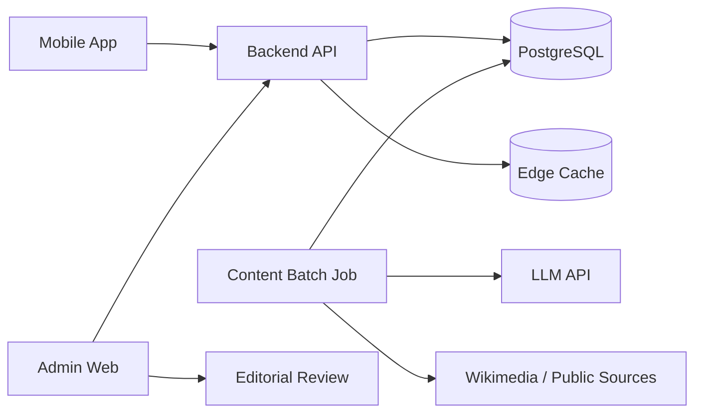
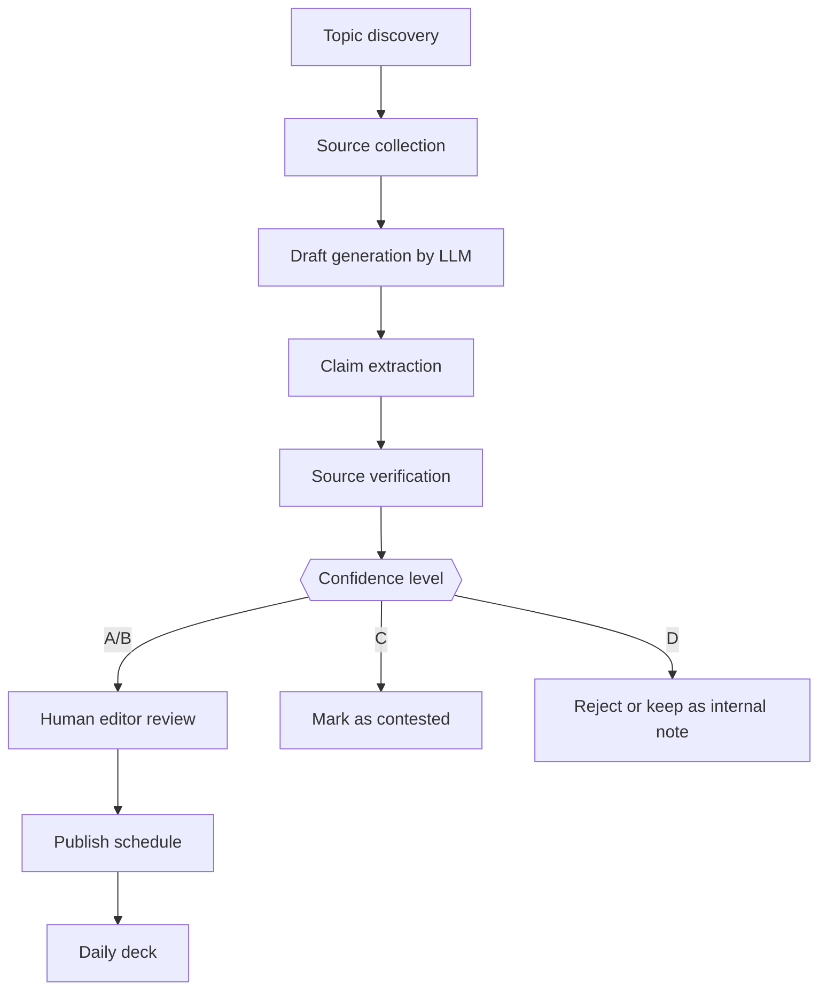

# へぇの種 - ドキュメント一式

作成日: 2026-07-07

## 概要

「へぇの種」は、毎日3枚の短い知識カードを読むことで、ちょっとした知識欲を満たす知的暇つぶしアプリです。学習管理アプリではなく、SNSや動画の代わりに1分で読める「へぇ」を提供する体験を中心に設計しています。

## ZIP内の構成

```text
hee_no_tane/
├─ docs/
│  ├─ 01_企画書.md
│  ├─ 02_要件定義_仕様書.md
│  ├─ 03_システム設計書.md
│  ├─ 04_AI_コンテンツ_ファクトチェック設計.md
│  ├─ 05_MVP開発計画_バックログ.md
│  ├─ 06_収益化_KPI_リスク.md
│  ├─ 07_画面ワイヤー_コピー.md
│  └─ 08_出典_調査メモ.md
├─ sample/
│  ├─ db_schema.sql
│  ├─ api_contract_openapi.yaml
│  └─ sample_cards.json
├─ prompts/
│  └─ content_generation_prompts.md
├─ diagrams/
│  ├─ architecture.mmd
│  └─ content_pipeline.mmd
└─ へぇの種_仕様設計書.docx
```

## 今回の前提

### 確認できた事実

- 短時間・小単位で学ぶ microlearning は、短い学習コンテンツを集中的に届ける手法として説明されている。
- Duolingo は Q1 2026 の株主向け資料で DAU 5,650万人、課金ユーザー 1,250万人を公表している。これは「短時間学習 + 習慣化 + ゲーム性」が大規模に成立しうる参考事例であり、このアプリの成功を保証するものではない。
- Wikimedia Analytics API には、ページビューや「よく見られたページ」等を取得する公式エンドポイントがある。
- Wikimedia API 利用時は User-Agent を設定し、過剰な並列アクセスを避ける必要がある。
- Google Play は Data safety section の記入を開発者に求め、Apple は App Review Guidelines で UGC や課金等の要件を定めている。

### 確認できない情報

- 日本国内で「知的暇つぶし」専用アプリにどの程度の課金需要があるか。
- 月額300〜500円のサブスクが成立するか。
- AI生成 + 人手承認で、十分なコンテンツ量と品質を低コストで維持できるか。

### 推測

- 最初から高額サブスクではなく、無料 + 広告 + 低価格プレミアム、または買い切り知識パックの方が受け入れられやすい。
- 「学習」「教養」よりも「へぇ」「散歩」「つまみ読み」のような軽い見せ方の方が継続率が出やすい。

## 参照情報

- **Duolingo Q1 2026 Shareholder Letter**  
  URL: https://investors.duolingo.com/static-files/aab30d54-eb91-422e-b365-c03859fea85c  
  用途: Q1 2026 metrics: DAUs 56.5M, paid subscribers 12.5M, both +21% YoY. Used only as evidence that short-session gamified learning can scale, not as proof this app will scale.
- **Wikimedia Analytics API**  
  URL: https://doc.wikimedia.org/generated-data-platform/aqs/analytics-api/  
  用途: Official documentation for page views, most-viewed / most-edited pages, and related Wikimedia analytics endpoints.
- **Wikimedia Analytics API - Page view analytics**  
  URL: https://doc.wikimedia.org/generated-data-platform/aqs/analytics-api/reference/page-views.html  
  用途: Page view analytics endpoints provide page-view data for Wikimedia projects, with data available from July 1, 2015.
- **Wikimedia API Etiquette**  
  URL: https://www.mediawiki.org/wiki/API:Etiquette  
  用途: Requires informative User-Agent and recommends considerate, serial requests.
- **Wikimedia Analytics API Access Policy**  
  URL: https://doc.wikimedia.org/generated-data-platform/aqs/analytics-api/documentation/access-policy.html  
  用途: User-Agent header is required; clients without User-Agent may be blocked.
- **Wikimedia Foundation Terms of Use**  
  URL: https://foundation.wikimedia.org/wiki/Policy:Terms_of_Use  
  用途: Wikimedia content is provided under free/open licenses; content is informational and not professional advice.
- **Creative Commons BY-SA 3.0 Deed**  
  URL: https://creativecommons.org/licenses/by-sa/3.0/deed.en  
  用途: Attribution and ShareAlike obligations when reusing/remixing licensed material.
- **Google Play Data safety section**  
  URL: https://support.google.com/googleplay/android-developer/answer/10787469?hl=en  
  用途: Developers must disclose how apps collect, share, and protect user data in Play Console.
- **Google Play User Data policy**  
  URL: https://support.google.com/googleplay/android-developer/answer/10144311?hl=en  
  用途: Data safety labels must be accurate, up to date, and consistent with the privacy policy.
- **Apple App Review Guidelines**  
  URL: https://developer.apple.com/app-store/review/guidelines/  
  用途: Guidelines cover user-generated content moderation, purchases, and review requirements.
- **ATD - What Is Microlearning?**  
  URL: https://www.td.org/talent-development-glossary-terms/what-is-microlearning  
  用途: Microlearning is focused, bite-sized learning content in short bursts.
- **OpenAI API Pricing**  
  URL: https://developers.openai.com/api/docs/pricing  
  用途: Current pricing reference as of document creation; costs must be rechecked before implementation.


\newpage


# 01_企画書: へぇの種

作成日: 2026-07-07

## 1. コンセプト

**へぇの種** は、日常の中でふと気になる知識を、毎日3枚のカードで届ける「知的暇つぶし」アプリです。

勉強アプリのように到達目標や試験対策を前面に出さず、SNS・ショート動画・ニュースの隙間に入る軽い体験を狙います。

### ひと言でいうと

> 毎日3つだけ、“知らなかった”を拾えるアプリ。

## 2. なぜ今作る価値があるか

### 確認できた事実

- Microlearning は、短い単位のコンテンツで特定の概念やスキルを学ぶ手法として説明されている。
- Duolingo は Q1 2026 の株主向け資料で DAU 5,650万人、課金ユーザー 1,250万人を公表しており、短時間の学習体験が大規模な継続利用につながる参考事例になる。
- Wikimedia Analytics API により、Wikipedia 系プロジェクトのページビューや人気ページを取得できるため、知識カードのネタ探索に使える。

### 確認できない情報

- 日本の一般ユーザーが「雑学・知識欲」だけに継続課金する市場規模。
- 「へぇの種」という名称での商標・競合状況。実装前に J-PlatPat 等で要確認。

### 推測

- 「勉強するぞ」という動機ではなく、「SNSを見るよりちょっと良い暇つぶし」という導線の方が入り口が広い。
- ユーザー投稿型にすると運用負荷が急増するため、初期は編集部運用 + AI補助が妥当。

## 3. ターゲット

| セグメント | 状況 | 刺さる価値 |
|---|---|---|
| 通勤・休憩中の大人 | 1〜3分の隙間時間がある | SNSより後悔しない暇つぶし |
| 子育て世代 | 子どもに話せる小ネタがほしい | 会話ネタになる |
| 雑学好き | Wikipediaは長すぎる | 入口だけ知りたい |
| 勉強は苦手だが知識欲はある層 | 教材感が嫌 | 正解を迫られない |

## 4. コア体験

1. アプリを開く。
2. 今日の「へぇの種」が3枚出る。
3. 1枚30秒で読む。
4. 気になったら「もう少し深掘り」を開く。
5. 関連カードへ進む。
6. 保存、共有、軽いクイズで締める。

## 5. 提供価値

| 価値 | 内容 |
|---|---|
| 軽い | 1カード30秒〜1分 |
| 信頼できる | 出典・確認レベルを表示 |
| つながる | 関連カードで知識が連鎖する |
| 疲れない | 正解・不正解より「へぇ回収」を重視 |
| 毎日戻れる | 今日の3枚、週間まとめ、保存 |

## 6. 競合との差別化

| 比較対象 | 弱点 | へぇの種の差別化 |
|---|---|---|
| 雑学アプリ | ネタが羅列されるだけ | 出典・関連・深掘り・確認レベル |
| Wikipedia | 長い、読み始めが重い | 30秒要約と知識散歩 |
| ニュースアプリ | 情報疲れする | 緊急性が低く、気楽 |
| クイズアプリ | 間違えるストレス | 「知らなかった」を集める体験 |
| ChatGPT単体 | 毎日起動する理由が弱い、出典確認が面倒 | 毎日配信 + 承認済みカード + 出典管理 |

## 7. 初期ジャンル

MVPでは以下の6ジャンルに絞ります。

1. 日常のなぜ
2. 体のふしぎ
3. 言葉の由来
4. 歴史の小ネタ
5. 身近な科学
6. 社会のしくみ

## 8. MVPの成功条件

| 指標 | 目標仮説 |
|---|---:|
| D1継続率 | 35%以上 |
| D7継続率 | 15%以上 |
| 1日あたりカード閲覧 | 2.2枚以上 |
| 保存率 | 8%以上 |
| 共有率 | 2%以上 |
| 出典クリック率 | 3%以上 |

上記は市場データから確認した値ではなく、MVP検証用の仮説値です。


\newpage


# 02_要件定義・仕様書

作成日: 2026-07-07

## 1. プロダクト名

へぇの種

## 2. 目的

ユーザーが毎日短時間で、信頼できる小さな知識を得られるアプリを提供する。

## 3. スコープ

### MVPで作る

- 今日の知識カード3枚
- ジャンル選択
- 30秒説明 / 3分深掘り
- 出典表示
- 確認レベル表示
- 保存
- 関連カード
- 軽いクイズ
- 簡易ストリーク
- 管理画面での記事承認

### MVPでは作らない

- ユーザー投稿機能
- リアルタイムAIチャット
- 完全自動公開
- 子ども専用UI
- 学習コース機能
- 詳細な知識グラフ可視化

## 4. ユーザー種別

| 種別 | 説明 |
|---|---|
| ゲスト | アカウントなし。今日の3枚を閲覧可能。保存は端末内のみ。 |
| 無料会員 | 保存・履歴・ジャンル設定が利用可能。広告あり。 |
| プレミアム会員 | 広告なし、深掘り無制限、過去カード閲覧、知識パック利用。 |
| 編集者 | 管理画面でカード作成・承認・公開停止。 |
| 管理者 | ユーザー・課金・監査ログを含む全管理。 |

## 5. 主要画面

| 画面 | 概要 |
|---|---|
| ホーム | 今日の3枚、進捗、ジャンルチップ |
| カード詳細 | 30秒説明、深掘り、出典、確認レベル |
| 関連カード | もっと知りたいカードの一覧 |
| 保存一覧 | 保存したカード、フォルダ |
| クイズ | 1カード1問の軽い確認 |
| マイページ | ストリーク、興味ジャンル、設定 |
| 管理画面 | カード承認、出典確認、公開管理 |

## 6. 機能要件

### F-001 今日のカード配信

- ユーザーごとに1日3枚のカードを表示する。
- 未ログイン時は全ユーザー共通の3枚を表示する。
- ログイン後はジャンル嗜好と既読履歴をもとに配信する。
- 同じカードは原則30日以内に再表示しない。

受け入れ条件:

- アプリ起動時に今日の日付のカードが3枚表示される。
- 既読済みカードは表示状態が変わる。
- オフライン時は最後に取得済みのカードを表示する。

### F-002 知識カード表示

各カードは以下を持つ。

| 項目 | 必須 | 説明 |
|---|---|---|
| タイトル | 必須 | 疑問形または意外性のある短文 |
| 30秒説明 | 必須 | 120〜180字程度 |
| 3分深掘り | 必須 | 600〜1,000字程度 |
| ジャンル | 必須 | 初期6ジャンルのいずれか |
| 確認レベル | 必須 | A/B/C/D |
| 出典 | 必須 | URL、媒体名、取得日 |
| 関連カード | 任意 | 1〜5件 |
| クイズ | 任意 | 1問 |

### F-003 確認レベル表示

| レベル | 表示名 | 条件 |
|---|---|---|
| A | 確認済み | 一次情報または信頼できる複数ソースで確認 |
| B | だいたい確認済み | 信頼できる単一ソース中心 |
| C | 諸説あり | 学説・説が分かれる |
| D | 小話 | 厳密な事実としては出せない。MVPでは原則非公開 |

### F-004 保存

- ユーザーはカードを保存できる。
- 保存解除できる。
- 無料会員は最大100件まで。
- プレミアム会員は無制限。

### F-005 関連カード

- カード詳細下部に関連カードを表示する。
- 関連理由を短く表示する。
- 例: 「下水道つながり」「言葉の由来つながり」。

### F-006 クイズ

- 読了後に1問だけ表示する。
- 正解数を競わせるより、「読んだ内容を思い出す」体験を優先する。
- 不正解時も軽い解説を表示する。

### F-007 ストリーク

- 1日1枚以上読めば継続扱い。
- 強すぎる通知・煽りは避ける。
- ストリーク切れ救済は週1回まで。

### F-008 共有

- カードタイトル、短い説明、アプリ名入り画像を生成して共有できる。
- 出典の全文転載は避ける。
- 著作権上の出典表記ルールを守る。

### F-009 管理画面

- カードの作成、編集、承認、公開停止ができる。
- 出典URL、取得日、確認レベル、編集メモを保存する。
- AI生成カードは承認されるまで公開不可。

## 7. 非機能要件

| 項目 | 要件 |
|---|---|
| 表示速度 | ホーム初期表示2秒以内を目標 |
| 可用性 | MVPは99.5%程度で可。厳密なSLAは不要 |
| オフライン | 直近カードはキャッシュ表示 |
| セキュリティ | APIキーはクライアントに置かない |
| プライバシー | 収集データを最小化。位置情報は使わない |
| 法務 | 出典、ライセンス、広告、課金表記を管理 |
| アクセシビリティ | 文字サイズ変更、十分なコントラスト |

## 8. 通知仕様

| 通知 | 初期値 | 内容 |
|---|---|---|
| 今日の3枚 | OFF推奨 | ユーザーが明示ONにした場合のみ |
| 週間まとめ | OFF | 週に読んだカードの振り返り |
| 新パック | OFF | プレミアム/買い切り訴求 |

## 9. 課金仕様

| プラン | 内容 |
|---|---|
| 無料 | 今日の3枚、保存100件、広告あり |
| プレミアム | 月300〜500円仮説、広告なし、深掘り・過去閲覧・保存無制限 |
| 買い切りパック | 日本史、身近な科学、子どもに話せる知識など |

価格は推測であり、ストア手数料・広告単価・継続率を見て再設計する。

## 10. 除外・注意トピック

以下はMVPでは避けるか、一般情報に限定する。

- 医療判断
- 投資判断
- 法律判断
- 災害・緊急時の行動指示
- 政治的に分断が大きいテーマ
- 差別・偏見につながる俗説
- 出典が弱い健康・美容ネタ


\newpage


# 03_システム設計書

作成日: 2026-07-07

## 1. 推奨アーキテクチャ

MVPでは、実装速度と運用コストを優先し、以下の構成を推奨します。

```text
Mobile App: Flutter or React Native
Backend: Supabase / Firebase / Cloudflare Workers + PostgreSQL
Admin: Web 管理画面
AI Batch: Python job or Edge Function
Content Source: Wikimedia API, 公的機関, 企業公式, 書籍メモ等
Analytics: PostHog / Firebase Analytics / Supabase events
Payment: App Store / Google Play In-App Purchase
```

特に Flutter + Supabase は、個人開発でも一通り実装しやすい構成です。ただし、最初からリアルタイム性は不要なので、Firebase でも問題ありません。

## 2. 全体構成



## 3. コンテンツ生成パイプライン



## 4. データモデル概要

### categories

| カラム | 型 | 説明 |
|---|---|---|
| id | uuid | 主キー |
| slug | text | `daily_why` 等 |
| name | text | 表示名 |
| sort_order | int | 並び順 |

### cards

| カラム | 型 | 説明 |
|---|---|---|
| id | uuid | 主キー |
| title | text | カードタイトル |
| hook | text | 一覧用の短い一文 |
| short_body | text | 30秒説明 |
| long_body | text | 3分深掘り |
| category_id | uuid | カテゴリ |
| confidence_level | text | A/B/C/D |
| status | text | draft/review/approved/published/archived |
| publish_date | date | 公開日 |
| created_at | timestamptz | 作成日時 |
| updated_at | timestamptz | 更新日時 |

### card_sources

| カラム | 型 | 説明 |
|---|---|---|
| id | uuid | 主キー |
| card_id | uuid | 対象カード |
| title | text | 出典名 |
| url | text | URL |
| source_type | text | official/academic/wiki/media/book/other |
| retrieved_at | date | 取得日 |
| license_note | text | ライセンスメモ |
| quote_used | boolean | 引用を使ったか |

### card_relations

| カラム | 型 | 説明 |
|---|---|---|
| from_card_id | uuid | 元カード |
| to_card_id | uuid | 関連カード |
| relation_type | text | cause/history/material/word/etc |
| reason | text | 関連理由 |

### user_events

| カラム | 型 | 説明 |
|---|---|---|
| id | uuid | 主キー |
| user_id | uuid | ユーザー |
| event_type | text | card_view/save/quiz/share/source_click |
| card_id | uuid | 対象カード |
| metadata | jsonb | 詳細 |
| occurred_at | timestamptz | 発生日時 |

## 5. API設計概要

| Method | Path | 説明 |
|---|---|---|
| GET | /v1/daily-deck | 今日の3枚を取得 |
| GET | /v1/cards/{{cardId}} | カード詳細を取得 |
| GET | /v1/cards/{{cardId}}/related | 関連カード取得 |
| POST | /v1/cards/{{cardId}}/save | 保存 |
| DELETE | /v1/cards/{{cardId}}/save | 保存解除 |
| POST | /v1/events | 閲覧・保存等のイベント送信 |
| GET | /v1/me/stats | 読了数・ストリーク取得 |
| GET | /v1/categories | カテゴリ一覧 |

管理者向け API は `/admin/v1` として分離する。

## 6. キャッシュ方針

| 対象 | キャッシュ |
|---|---|
| 今日の共通デッキ | 24時間 |
| カード詳細 | 更新まで長期キャッシュ可 |
| ユーザー別デッキ | 1日 |
| 関連カード | 1日〜7日 |
| 出典情報 | 長期キャッシュ可 |

## 7. AI利用設計

### オンライン生成は避ける

MVPでは、ユーザーが開いた瞬間にAI生成する構成は避けます。理由は以下です。

- レスポンスが遅くなる。
- コストが読めない。
- 誤情報がそのまま出る危険がある。
- ストア審査やユーザー信頼の観点で説明しづらい。

### 推奨: バッチ生成 + 人手承認

1. 毎日または週次で候補トピックを収集。
2. LLMで下書きを作成。
3. 出典・主張を分解。
4. 管理画面で人が承認。
5. 公開日を設定。

## 8. セキュリティ設計

- クライアントに LLM API キーを保存しない。
- 管理APIは管理者権限必須。
- RLSまたはAPI側認可でユーザーデータ分離。
- 管理画面には操作ログを残す。
- 出典URLの取得処理では SSRF 対策を行う。

## 9. プライバシー設計

MVPでは、ユーザー個人を強く追跡する必要はない。

収集する可能性があるデータ:

- ユーザーID
- メールアドレスまたは匿名ID
- 既読カード
- 保存カード
- クイズ回答
- ジャンル嗜好
- 課金状態

収集しない方針:

- 位置情報
- 連絡先
- 写真
- マイク
- 健康情報

Google Play の Data safety section とプライバシーポリシーの整合性を保つ必要がある。

## 10. 開発ディレクトリ例

```text
hee_no_tane_app/
├─ app/                    # Flutter / React Native app
├─ backend/                # API / Edge Functions
├─ admin/                  # 管理画面
├─ content-jobs/           # AI生成・出典チェックバッチ
├─ db/                     # migrations / seed data
├─ docs/                   # 仕様書
└─ scripts/                # 運用スクリプト
```


\newpage


# 04_AI・コンテンツ・ファクトチェック設計

作成日: 2026-07-07

## 1. 基本方針

「へぇの種」の価値は、AI生成そのものではなく、**短く、読みやすく、出典のある知識カード**にあります。

そのため、AIは公開本文を自動で確定する役割ではなく、下書き・要約・クイズ化・関連付けの補助として使います。

## 2. コンテンツカードの品質基準

| 観点 | 基準 |
|---|---|
| 面白さ | タイトルだけで読みたくなる |
| 短さ | 30秒説明は120〜180字程度 |
| 正確性 | 主要主張に出典がある |
| 読みやすさ | 小学生高学年〜大人が読める |
| 中立性 | 断定しすぎない |
| 安全性 | 医療・法律・投資判断をしない |

## 3. カード構造

```json
{
  "title": "なぜマンホールのふたは丸いことが多いの？",
  "hook": "落ちにくさと扱いやすさに理由があります。",
  "short_body": "マンホールのふたが丸いと、どの向きにしても穴に落ちにくいという利点があります。また、重いふたを転がして動かしやすい点も現場では便利です。",
  "long_body": "...",
  "confidence_level": "A",
  "sources": [],
  "quiz": {}
}
```

## 4. 確認レベル判定

| レベル | 公開可否 | 条件 |
|---|---|---|
| A | 公開可 | 公的機関、大学、企業公式、一次資料、または信頼できる複数資料で一致 |
| B | 公開可 | 信頼できる単一資料で確認できるが、補助出典が弱い |
| C | 条件付き公開 | 諸説ありとして明示。タイトルも断定しない |
| D | 原則非公開 | 出典が弱い、俗説、話として面白いだけ |

## 5. AI生成フロー

1. トピック候補を作る。
2. 出典候補を集める。
3. AIがカード下書きを作る。
4. AIが本文中の主張を箇条書きで抽出する。
5. 各主張に対応する出典を紐づける。
6. 信頼レベルを仮判定する。
7. 編集者が確認し、承認する。

## 6. 出典利用ルール

### Wikimedia を使う場合

- Wikimedia Analytics API は、人気ページやページビューからトピック発見に使う。
- Wikipedia本文をそのまま転載しない。
- 参考にした場合は、カードの出典欄にページ名、URL、取得日、ライセンスメモを残す。
- Wikimedia API 利用時は User-Agent を設定する。
- 過剰な並列リクエストは避ける。

### 公式情報を優先する例

| ジャンル | 優先ソース |
|---|---|
| 天気・気象 | 気象庁、大学、研究機関 |
| 体のふしぎ | 厚生労働省、医療機関、大学。ただし医療助言は避ける |
| 食品表示 | 消費者庁、農林水産省、企業公式 |
| 歴史 | 博物館、自治体、大学、国立機関 |
| 科学 | 大学、研究機関、専門団体 |
| 言葉 | 辞書、国語研究所、専門書 |

## 7. NG表現

| NG | 修正例 |
|---|---|
| 絶対に〜 | 多くの場合〜 / 一般に〜 |
| 医学的に治る | 一般情報として〜。症状がある場合は専門家へ |
| これが真実 | 有力な説明の一つは〜 |
| Wikipediaによると〜だけで断定 | 公式・専門ソースで補強する |

## 8. 監査ログ

カードごとに以下を残す。

- 生成プロンプトバージョン
- 使用モデル
- 生成日時
- 出典URL
- 編集者ID
- 承認日時
- 確認レベル
- 公開後修正履歴

## 9. 公開停止基準

以下の場合は即時公開停止する。

- 出典URLが消滅し、代替確認ができない。
- ユーザーから重大な誤情報指摘がある。
- 医療・法律・投資判断に見える表現が含まれる。
- 著作権・ライセンス上の懸念がある。
- 差別的・有害な解釈につながる。

## 10. コンテンツ在庫計画

MVP公開前に最低300枚を用意する。

| 用途 | 枚数 |
|---|---:|
| 初期公開カード | 180枚 |
| 予備カード | 60枚 |
| 季節カード | 30枚 |
| テスト用カード | 30枚 |

毎日3枚配信なら、300枚で約100日分。ただし、ユーザー嗜好別出し分けをするなら早期に不足するため、週30〜50枚の追加制作体制が必要。


\newpage


# 05_MVP開発計画・バックログ

作成日: 2026-07-07

## 1. 開発方針

最初に作るべきものは、AIチャットではなく「毎日3枚を気持ちよく読む体験」です。

## 2. フェーズ

### Phase 0: コンテンツ検証プロトタイプ

期間目安: 1週間

目的:

- カードの面白さを検証する。
- AI生成 + 人手修正の作業量を測る。
- 30秒説明と3分深掘りの文体を固める。

成果物:

- 50枚のカード
- 出典付きスプレッドシートまたは管理DB
- 共有画像の試作

### Phase 1: MVPアプリ

期間目安: 4〜6週間

機能:

- ホーム
- 今日の3枚
- カード詳細
- 保存
- 関連カード
- クイズ
- 簡易ログイン
- 管理画面
- API

### Phase 2: クローズドβ

期間目安: 2〜3週間

目的:

- D1/D7継続率を確認。
- カードの満足度を確認。
- 出典表示が重すぎないか確認。
- 共有されるか確認。

### Phase 3: 課金・広告検証

期間目安: 2〜4週間

機能:

- 広告
- プレミアム
- 過去カード閲覧
- パック販売

## 3. バックログ

### Mobile

| 優先 | タスク | 完了条件 |
|---|---|---|
| P0 | Flutter/React Nativeプロジェクト作成 | iOS/Androidで起動する |
| P0 | ホーム画面 | 今日の3枚が表示される |
| P0 | カード詳細 | 30秒/3分/出典/確認レベルを表示 |
| P0 | 保存機能 | 保存/解除できる |
| P0 | オフラインキャッシュ | 直近カードが表示される |
| P1 | クイズ | 読了後に1問表示 |
| P1 | 共有画像 | SNS共有できる |
| P1 | マイページ | ストリーク・読了数表示 |

### Backend

| 優先 | タスク | 完了条件 |
|---|---|---|
| P0 | DBマイグレーション | sample/db_schema.sql 相当を適用 |
| P0 | daily-deck API | 今日の3枚を返す |
| P0 | card detail API | カード詳細を返す |
| P0 | events API | 閲覧/保存/共有ログを保存 |
| P0 | admin認可 | 管理者以外が管理APIへ入れない |
| P1 | パーソナライズ | 既読・嗜好で出し分け |
| P1 | 課金状態反映 | ストア課金の状態を保存 |

### Admin

| 優先 | タスク | 完了条件 |
|---|---|---|
| P0 | カード一覧 | 状態で絞り込み可能 |
| P0 | カード編集 | 本文・出典・確認レベルを編集 |
| P0 | 承認フロー | draft→review→approved→published |
| P1 | 出典リンクチェック | URL死活確認 |
| P1 | 差し戻しコメント | 編集者間で確認可能 |

### Content Jobs

| 優先 | タスク | 完了条件 |
|---|---|---|
| P0 | AI下書き生成 | プロンプトからJSONで出力 |
| P0 | 主張抽出 | 本文からclaimを抽出 |
| P0 | 出典メタ保存 | URL/取得日/ライセンスメモを保存 |
| P1 | Wikimedia人気ページ取得 | 候補トピックを取得 |
| P1 | 類似カード検出 | 既存カードとの重複を警告 |

## 4. AIエージェント向け作業指示例

### 指示1: DB作成

> `sample/db_schema.sql` をもとに Supabase/PostgreSQL 用のマイグレーションを作成してください。RLSを有効化し、一般ユーザーは published の cards と自分の user_events / saved_cards のみ操作できるようにしてください。

### 指示2: Mobile MVP

> `/v1/daily-deck` と `/v1/cards/{{id}}` を呼び出す Flutter 画面を作ってください。ホームには今日の3枚、詳細には短文/深掘り/出典/確認レベル/保存ボタンを表示してください。状態管理は Riverpod か標準的な手法で構いません。

### 指示3: Admin MVP

> cards テーブルの CRUD と status 遷移を行う管理画面を作ってください。AI生成カードは承認されるまで published にならないようにしてください。

## 5. リリース前チェックリスト

- [ ] 出典なしカードが公開されない
- [ ] Dレベルカードが公開されない
- [ ] AI APIキーがクライアントに含まれていない
- [ ] プライバシーポリシーとData safetyの内容が一致している
- [ ] App Store / Google Play の課金表記が明確
- [ ] 通知はデフォルトOFFまたは明示同意後ON
- [ ] 医療・法律・投資系の断定表現がない
- [ ] 削除・公開停止が管理画面からできる


\newpage


# 06_収益化・KPI・リスク

作成日: 2026-07-07

## 1. 収益化方針

最初から高額課金を狙わず、無料で習慣化を作ってから、低価格プレミアムまたは買い切りパックで収益化する。

## 2. 収益モデル

| モデル | 内容 | 向き不向き |
|---|---|---|
| 広告 | 無料ユーザーにバナー/ネイティブ広告 | 初期向き。ただし知的体験を壊しやすい |
| 月額プレミアム | 300〜500円仮説 | 継続率が必要 |
| 買い切りパック | 160〜480円程度の知識パック仮説 | サブスク抵抗がある層に向く |
| 親子向けパック | ふりがな/会話用カード | 差別化しやすい |
| 書籍化/電子書籍 | 人気カードをまとめる | 後期向け |

価格は推測。実装前に競合・ストア価格・ユーザー調査で再検証する。

## 3. プレミアム機能案

| 機能 | 無料 | プレミアム |
|---|---|---|
| 今日の3枚 | ○ | ○ |
| 広告 | あり | なし |
| 保存 | 100件 | 無制限 |
| 過去カード閲覧 | 直近7日 | 全件 |
| 深掘り | 1日3件 | 無制限 |
| ジャンル指定 | 3ジャンル | 全ジャンル |
| 知識パック | 一部 | 含む/割引 |

## 4. KPI

### Acquisition

| KPI | 見る理由 |
|---|---|
| ストアCVR | アイコン・説明・スクショの強さ |
| インストール単価 | 広告出稿時の成立性 |
| 共有経由インストール | オーガニック拡散 |

### Activation

| KPI | 目標仮説 |
|---|---:|
| 初回3枚完読率 | 60%以上 |
| 初回保存率 | 10%以上 |
| 初回ジャンル選択率 | 40%以上 |

### Retention

| KPI | 目標仮説 |
|---|---:|
| D1継続率 | 35%以上 |
| D7継続率 | 15%以上 |
| D30継続率 | 5%以上 |

### Revenue

| KPI | 目標仮説 |
|---|---:|
| 無料→有料CVR | 1〜3% |
| 月額解約率 | 15%以下を目標 |
| 広告ARPDAU | 要検証 |

### Quality

| KPI | 目標仮説 |
|---|---:|
| 誤情報指摘率 | 0.1%未満 |
| 出典クリック率 | 3%以上 |
| カード低評価率 | 5%未満 |
| 公開停止カード率 | 2%未満 |

これらは確認済み市場値ではなく、MVP検証用の仮説。

## 5. 主要リスク

| リスク | 影響 | 対策 |
|---|---|---|
| 雑学アプリ化して薄くなる | 継続率低下 | 出典・関連・深掘り・知識連鎖で差別化 |
| AIの誤情報 | 信頼低下 | 人手承認、確認レベル、公開停止フロー |
| コンテンツ制作が重い | 運用破綻 | AI下書き + テンプレ + 週次制作 |
| Wikipedia依存 | 差別化・ライセンス懸念 | 公式ソースを優先し、Wikipediaは発見用途中心 |
| 課金されない | 収益化失敗 | 広告/パック/プレミアムの複線化 |
| ストア審査 | リリース遅延 | UGCなし、プライバシー最小化、課金表記明確化 |

## 6. 初期費用感

### 個人開発・AIエージェント利用

| 項目 | 目安 |
|---|---:|
| アプリ実装 | 0〜30万円相当の工数 |
| バックエンド | 0〜20万円相当の工数 |
| 管理画面 | 0〜20万円相当の工数 |
| コンテンツ初期制作 | かなり工数依存 |
| API/サーバー | 初期は月0〜数千円 |
| LLM生成 | バッチ中心なら低額に抑えやすい |

外注する場合はMVPでも100万〜300万円程度に膨らむ可能性がある。これは推測であり、実装範囲・デザイン品質・管理画面の作り込みで大きく変わる。

## 7. 収益化判断のゲート

次を満たしてから課金実装に進む。

- D7継続率が15%前後ある。
- 初回3枚完読率が60%以上ある。
- 保存率または共有率に明確な反応がある。
- 100人以上のβで「毎日見たい」という声がある。

これを満たさない場合、課金より先にコンテンツ品質・カードUI・ジャンル設計を見直す。


\newpage


# 07_画面ワイヤー・コピー

作成日: 2026-07-07

## 1. ホーム画面

```text
┌────────────────────────────┐
│ へぇの種             🔍 ⚙ │
├────────────────────────────┤
│ 今日の3つのへぇ              │
│ 7月7日 火曜日                │
│                              │
│ [日常のなぜ]                 │
│ なぜマンホールのふたは丸い？ │
│ 落ちにくさと扱いやすさに理由 │
│ があります。             >  │
│                              │
│ [言葉の由来]                 │
│ 「大丈夫」はなぜ丈夫なの？   │
│ もともとは立派な男性を指す… >│
│                              │
│ [身近な科学]                 │
│ 冷たい飲み物のコップに水滴… >│
└────────────────────────────┘
```

## 2. カード詳細

```text
┌────────────────────────────┐
│ < 戻る                  ☆  │
├────────────────────────────┤
│ なぜマンホールのふたは丸い？ │
│ A 確認済み                  │
│                              │
│ 30秒でへぇ                   │
│ マンホールのふたが丸いと、   │
│ どの向きにしても穴に落ち…   │
│                              │
│ [もっと深掘りする]           │
│                              │
│ 出典                         │
│ ・〇〇公式サイト              │
│ ・Wikipedia: Manhole cover    │
│                              │
│ 関連するへぇ                 │
│ ・下水道はいつからある？     │
└────────────────────────────┘
```

## 3. 確認レベルの文言

| レベル | 表示文言 |
|---|---|
| A | 複数の信頼できる出典で確認済み |
| B | 信頼できる出典で確認済み |
| C | 諸説あり。断定せず紹介しています |
| D | 小話レベル。公開前確認が必要 |

## 4. 読了後のコピー

```text
今日のへぇを1つ回収しました。

もう少しだけ知る？
[関連するへぇを見る]
[今日はここまで]
```

## 5. クイズ画面

```text
さっきのへぇ、覚えてる？

マンホールのふたが丸い理由として、よく挙げられるものは？

A. 作るのが一番安いから
B. 穴に落ちにくいから
C. 水を吸いやすいから

[答える]
```

## 6. 共有画像文言

```text
今日のへぇ

なぜマンホールのふたは丸い？

どの向きにしても穴に落ちにくく、
重いふたを転がして動かしやすいから。

へぇの種
```

## 7. 初回オンボーディング

### 1枚目

```text
毎日3つだけ、知らなかったを拾おう。
```

### 2枚目

```text
30秒で読めて、気になったら3分だけ深掘り。
```

### 3枚目

```text
出典つき。諸説ある話は、ちゃんと諸説ありと表示します。
```

## 8. 空状態

| 状態 | コピー |
|---|---|
| 保存なし | 気になったへぇを保存すると、ここに集まります。 |
| オフライン | 通信できません。最後に取得したへぇを表示しています。 |
| 全部読了 | 今日の3つは回収済み。明日また小さなへぇを届けます。 |

## 9. ストア説明文案

へぇの種は、毎日3つの短い知識カードで、ちょっとした知識欲を満たすアプリです。日常のなぜ、言葉の由来、身近な科学、歴史の小ネタなどを、30秒で読める形でお届けします。気になったら3分だけ深掘り。出典と確認レベルも表示するので、ただの雑学より少し安心して読めます。


\newpage


# 08_出典・調査メモ

作成日: 2026-07-07

## 1. 確認できた事実

| 事実 | 出典 |
|---|---|
| Microlearning は、短い単位のコンテンツで特定のスキルや概念を学ぶ手法として説明されている。 | ATD - What Is Microlearning? |
| Duolingo は Q1 2026 資料で DAU 5,650万人、課金ユーザー 1,250万人を公表している。 | Duolingo Q1 2026 Shareholder Letter |
| Wikimedia Analytics API は、ページビュー、よく見られたページ、編集等のデータ取得を提供している。 | Wikimedia Analytics API |
| Wikimedia の Page view analytics は、2015-07-01以降のページビューを扱う。 | Wikimedia Analytics API - Page view analytics |
| Wikimedia API では User-Agent を設定する必要があり、無設定クライアントはブロックされる可能性がある。 | Wikimedia API Etiquette / Access Policy |
| Wikimediaコンテンツは自由・オープンなライセンスで共有・再利用できるが、ライセンス条件と出典表示に注意が必要。 | Wikimedia Foundation Terms of Use / CC BY-SA 3.0 Deed |
| Google Play は Data safety section の記入を開発者に求める。 | Google Play Data safety section |
| Google Play のデータ安全性情報は正確・最新で、プライバシーポリシーと一致している必要がある。 | Google Play User Data policy |
| Apple App Store はUGC、課金、審査要件などのガイドラインを定めている。 | Apple App Review Guidelines |

## 2. 確認できない情報

- 日本市場で「知的暇つぶし」アプリがどの程度の広告収益・課金収益を出せるか。
- ユーザーが出典表示を価値として感じるか、それとも邪魔に感じるか。
- AI生成カードに対するユーザーの信頼度。
- 「へぇの種」という名称の商標上の利用可否。

## 3. 推測

- 事実の正確性を重視するほど運用負荷は上がるが、「ただの雑学アプリ」と差別化できる。
- 起動頻度を増やすには、ニュースのような速報性よりも「今日の3枚」という軽い日課化が合う。
- 初期はユーザー投稿を入れない方が、審査・モデレーション・品質管理のリスクが低い。

## 4. 参照URL一覧

- **Duolingo Q1 2026 Shareholder Letter**  
  URL: https://investors.duolingo.com/static-files/aab30d54-eb91-422e-b365-c03859fea85c  
  用途: Q1 2026 metrics: DAUs 56.5M, paid subscribers 12.5M, both +21% YoY. Used only as evidence that short-session gamified learning can scale, not as proof this app will scale.
- **Wikimedia Analytics API**  
  URL: https://doc.wikimedia.org/generated-data-platform/aqs/analytics-api/  
  用途: Official documentation for page views, most-viewed / most-edited pages, and related Wikimedia analytics endpoints.
- **Wikimedia Analytics API - Page view analytics**  
  URL: https://doc.wikimedia.org/generated-data-platform/aqs/analytics-api/reference/page-views.html  
  用途: Page view analytics endpoints provide page-view data for Wikimedia projects, with data available from July 1, 2015.
- **Wikimedia API Etiquette**  
  URL: https://www.mediawiki.org/wiki/API:Etiquette  
  用途: Requires informative User-Agent and recommends considerate, serial requests.
- **Wikimedia Analytics API Access Policy**  
  URL: https://doc.wikimedia.org/generated-data-platform/aqs/analytics-api/documentation/access-policy.html  
  用途: User-Agent header is required; clients without User-Agent may be blocked.
- **Wikimedia Foundation Terms of Use**  
  URL: https://foundation.wikimedia.org/wiki/Policy:Terms_of_Use  
  用途: Wikimedia content is provided under free/open licenses; content is informational and not professional advice.
- **Creative Commons BY-SA 3.0 Deed**  
  URL: https://creativecommons.org/licenses/by-sa/3.0/deed.en  
  用途: Attribution and ShareAlike obligations when reusing/remixing licensed material.
- **Google Play Data safety section**  
  URL: https://support.google.com/googleplay/android-developer/answer/10787469?hl=en  
  用途: Developers must disclose how apps collect, share, and protect user data in Play Console.
- **Google Play User Data policy**  
  URL: https://support.google.com/googleplay/android-developer/answer/10144311?hl=en  
  用途: Data safety labels must be accurate, up to date, and consistent with the privacy policy.
- **Apple App Review Guidelines**  
  URL: https://developer.apple.com/app-store/review/guidelines/  
  用途: Guidelines cover user-generated content moderation, purchases, and review requirements.
- **ATD - What Is Microlearning?**  
  URL: https://www.td.org/talent-development-glossary-terms/what-is-microlearning  
  用途: Microlearning is focused, bite-sized learning content in short bursts.
- **OpenAI API Pricing**  
  URL: https://developers.openai.com/api/docs/pricing  
  用途: Current pricing reference as of document creation; costs must be rechecked before implementation.


\newpage
